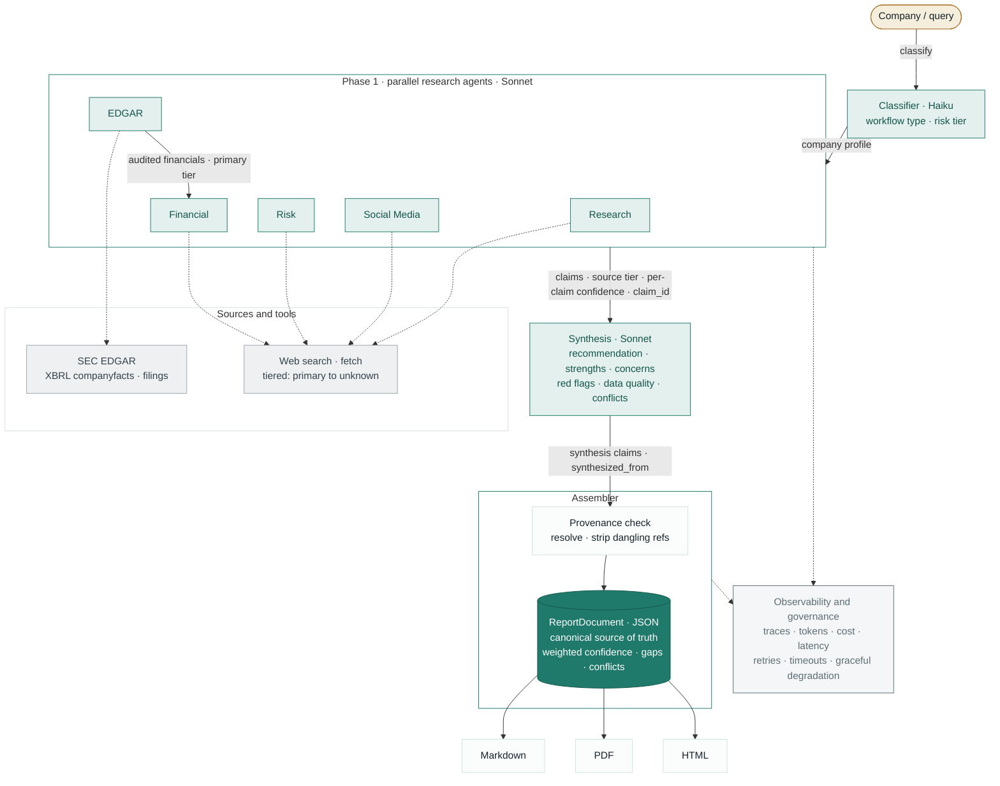
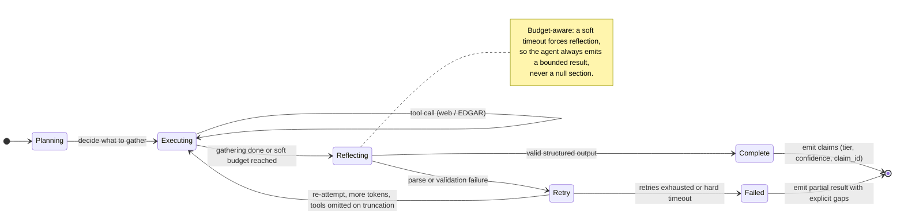
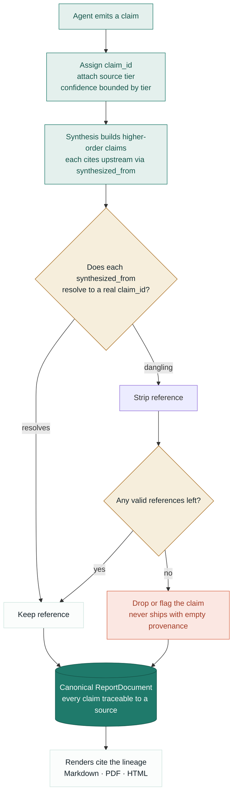

# Agentic Due Diligence

**A multi-agent system that turns a company name into a sourced, scored, and fully traceable due-diligence report.**

Built as a working answer to one question: what does it actually take to move an AI agent from an impressive demo to something you could run in a regulated or high-trust workflow? Every claim in a report carries its source, a confidence grounded in the quality of that source, and a provenance trail back to the agent and tool that produced it.

> Personal, build-in-public project on public data. Not investment advice and not a commercial product. It exists to demonstrate the engineering that makes agentic systems production-credible.

`Python` · `Anthropic API (Claude)` · `async multi-agent orchestration` · `SEC EDGAR` · `tiered RAG`

---

## The problem

Agent demos look impressive because an agent can call tools and produce fluent output. They fall apart the moment someone in a regulated or high-trust setting asks the questions that matter: where did this number come from, how sure are we, what did the system actually do, and what happens when a source is unreachable. A demo optimizes for looking right. Production has to be checkable.

Due diligence is a sharp version of that gap. A research report that reads well but cites an unnamed blog for a material fact, or hands back one confident score that averages a solid claim together with a guess, is worse than no report at all. This project treats the governance layer as the product: the agents gather, but the system is built so that nothing reaches the final report without a source, a confidence bounded by that source, and a traceable lineage.

## Architecture



A classifier routes the company, five specialist agents run in parallel, a synthesis pass reconciles them, and an assembler validates provenance and writes one canonical `ReportDocument`. Markdown, PDF, and HTML are pure renders of that document, never a separate source of truth.

### Agent state machine

Each specialist agent runs the same loop: plan, gather with tools, reflect into structured claims. It is built so that a parse failure or a timeout degrades to a bounded partial result with explicit gaps, never a null section.



### Claim and provenance lifecycle

This is the path every fact takes, and the reason a report is trustworthy. A claim is born with a source tier and a confidence bounded by that tier, synthesis cites it by id, and the assembler refuses to ship any synthesized claim whose lineage does not resolve.



## Agent workflow

Each specialist agent runs a small state machine rather than a single prompt:

**plan → execute (tool use) → reflect → emit claims**, with bounded retries and a graceful timeout that returns partial results instead of failing silent.

- **Planning.** The agent decides what it needs before acting, scoped by the classifier's workflow and risk tier.
- **Tool use.** Research, Financial, Risk, and Social agents use web search and fetch; the EDGAR agent pulls SEC XBRL company facts and filings directly. Tool calls are async so the five agents genuinely run in parallel rather than serializing behind a blocked event loop.
- **Retrieval (tiered RAG).** Retrieved evidence is ranked by source tier (primary document → reputable secondary → aggregator → community → unknown). The tier travels with the claim and caps how confident that claim is allowed to be.
- **State and memory.** Each agent carries its working state across turns within a run; the canonical `ReportDocument` is the durable, inspectable record of everything the run knew, decided, used, and produced.
- **Execution flow.** Agents emit structured claims, each with a `claim_id`, a source tier, and a per-claim confidence. The EDGAR agent's audited figures merge into the financial section at primary tier. Synthesis then writes higher-order claims (recommendation, strengths, concerns, red flags, data-quality assessment, conflicts), each citing the upstream claims it was built from via `synthesized_from`.

## Evaluation approach

The discipline here is that the only acceptance signal is a real end-to-end run, never a green unit test in isolation. Tests prove a path exists; a live run proves the behavior is real.

- **Provenance resolution as a hard check.** Every `synthesized_from` reference must resolve to a real upstream `claim_id`. On a recent full Apple run, 72 of 72 references resolved with zero dangling, and no synthesized claim shipped with empty provenance.
- **Ground-truth anchoring.** Financials are checked against audited SEC XBRL rather than model recall (for example, FY2025 revenue and net income are pulled from the 10-K at primary tier, not paraphrased).
- **Regression discipline.** Fixes are validated by re-running the same company and diffing the canonical document, so a change that "passes tests" but breaks a live run is caught.
- **Honest about calibration.** Confidence today is **bounded** by source tier, not **empirically calibrated**. The system will not claim a "medium" label is right seven times in ten, because that requires measuring predictions against outcomes over many reports, which is not yet done. Stating which of the two you have is part of the work.

## Guardrails and controls

- **Confidence is bounded by evidence.** A claim from an SEC filing can be high; the same claim from an unnamed source cannot, regardless of how fluently it is phrased.
- **No claim ships without resolvable provenance.** The assembler resolves and strips unresolvable references before writing the document, so synthesized strengths, concerns, and red flags trace back to real evidence.
- **Gaps over guesses.** When data is not available (for example, a private company with no XBRL filings), the field is reported as an explicit gap rather than fabricated.
- **Conflict detection.** Cross-agent disagreements (for example, a social-media figure that does not match the audited financials) are surfaced as data conflicts rather than averaged away.
- **Graceful failure.** Per-agent timeouts and budget-aware reflection return a bounded partial result with explicit gaps instead of a null section, and the synthesis layer flags any agent that degraded.

## Observability and tracing

Every run emits `run_metadata` that makes it operable and debuggable:

- per-agent LLM calls, tool calls, token counts, and status
- cost and end-to-end latency
- `tier_coverage` (the share of sources at each tier) and `section_confidences`
- a weighted overall confidence and the `data_quality` assessment with its reasoning

Because the `ReportDocument` records what each agent produced and how synthesis combined it, a run is effectively replayable: you can see what the system knew, what it decided, and why a number is what it is. This is what made it possible to diagnose real failures (a retry storm caused by truncated JSON, an event loop blocked by a synchronous client) from evidence rather than guesswork.

## Demo

The fastest way to see what this system does is to read one of its reports. The files
below are actual output from a single run against a public company, Apple Inc. I picked
Apple because its filings, court records, and press coverage are all public and easy to
spot-check against the report's sources.

- **[Read it on GitHub](docs/sample-report-apple.md)** (Markdown, renders in the browser)
- **[Download the PDF](docs/sample-report-apple.pdf)** (formatted report)

### Pinned run

This report is a snapshot, not a live document. The pipeline pulls public data at run
time, so outputs drift between runs (rankings, scraped counts, and section confidences
all move). The committed files come from one specific run, so what you read matches what
the system actually produced:

- **Run:** 2026-06-21 02:27 EDT
- **Commit:** c87435c5039a5b6faf000f47611275e861593450
- **Run cost / time:** $1.25, 331s, 26 LLM calls, 31 tool calls
- **EDGAR ground-truth:** matched (CIK 0000320193)

### What this is, and what it isn't

Generated by the multi-agent pipeline from public sources. It is a demonstration of the
system, not professional due diligence and not investment advice, and it is not affiliated
with, authorized by, or endorsed by Apple Inc. The same disclaimer is on the report itself.

### What to look for

A few things that show what the pipeline is doing under the hood:

- **Per-claim confidence.** Every item carries HIGH / MED / LOW, bounded by the reliability
  tier of its source rather than asserted.
- **Tiered, clickable sources.** Primary sources (SEC/EDGAR filings, court dockets) are
  separated from secondary press and community signal, and you can click through to check
  any of them.
- **It surfaces its own uncertainty.** The report includes a data-quality grade, conflicts
  between agents (for example, two different employee counts from different sources), and
  follow-up questions, instead of hiding what it could not resolve.
- **Full run accounting.** The methodology footer reports the per-agent cost, token, and
  tool-call breakdown, plus whether EDGAR ground-truth matched.

### Reproduce it

```bash
python -m src.main "APPLE"
```

Your output will differ from the pinned run as the underlying public data changes. That
variability is expected, and it is why the committed report is frozen to the run above.

## How to run locally

Requires Python 3.11+.

```bash
git clone https://github.com/rbsundaramoorthy/agentic-due-diligence.git
cd agentic-due-diligence

python -m venv venv && source venv/bin/activate
pip install -e ".[dev]"          # dependencies are declared in pyproject.toml
```

### API keys

Set these before running. `ANTHROPIC_API_KEY` and `BRAVE_API_KEY` are required for a
full live run; the other two unlock primary-tier source coverage and the run degrades
gracefully without them.

```bash
# Required
export ANTHROPIC_API_KEY=sk-ant-...        # Claude — every agent and synthesis
export BRAVE_API_KEY=...                    # web search for Research/Financial/Risk/Social

# Recommended (the run still completes without them, with reduced source coverage)
export SAM_GOV_API_KEY=...                  # SAM.gov federal-contractor registry (Risk agent)
export COURTLISTENER_API_KEY=...            # CourtListener PACER dockets (Risk agent; unauthenticated works but is rate-limited)
```

No keys to hand? Set `USE_MOCK_SEARCH=true` to run without `BRAVE_API_KEY` using canned
search results. Two further optional vars: `OPENCORPORATES_API_KEY` (entity registration
for the Research agent; falls back to web search if absent) and `EDGAR_USER_AGENT`
(identifies your app to SEC EDGAR, e.g. `"YourApp/1.0 you@example.com"`).

```bash
# run a report (company name is a positional argument)
python -m src.main "APPLE"
python -m src.main "Stripe" --json-only     # JSON only, skip PDF/HTML
python -m src.main "Stripe" --dump-db       # also print the full observability DB

# run the tests
python -m pytest tests/
```

Every run writes to `outputs/`: the canonical `ReportDocument` (`report_<slug>.json`) plus
Markdown, PDF, and HTML renders, and the SQLite observability DB (`agent_log.db`).

## What I would productionize next

This is a working system, not a platform. If I were taking it into a regulated production setting, in priority order:

1. **Empirical confidence calibration.** Score predictions against outcomes so a confidence label is earned, not just bounded by tier. This is the highest-value gap and the honest current limit.
2. **Human-in-the-loop approval gates.** Route high-impact or low-confidence conclusions to a reviewer before they are surfaced, with the decision captured in the audit trail.
3. **Identity- and ACL-safe retrieval.** Tenant scoping and access controls so the same pipeline can run over private and internal sources safely.
4. **A real eval harness.** Labeled golden datasets, regression gates in CI, and hallucination checks run on every change rather than ad hoc.
5. **Cost and deployment controls.** Per-run budgets, model routing by task, and deployment gates tied to eval thresholds.
6. **Finish the derived-metric path.** Compute annual growth and similar figures deterministically from EDGAR facts as primary-tier derived claims, gapping honestly when the data is not present.

## Agentic AI Control Plane

I created a one-page reference architecture for production agentic AI systems. This project is one concrete instance of it:

- Intent & workflow gating
- ACL-safe RAG
- Tool governance
- Agent runtime controls
- Evals and guardrails
- Observability and replayable traces

[View the Agentic AI Control Plane (PDF)](docs/agentic-ai-control-plane.pdf)

---

### Why this project exists

It is the reference implementation behind a build-in-public series on the gates an AI agent has to clear before it belongs in regulated production: audit trail, provenance, per-claim confidence, and failure behavior. The goal is to show the governance layer that turns a frontier model into a reliable enterprise workflow, with working code rather than slides.

Built by Raj Sundaramoorthy · Applied AI Engineering Leader · github.com/rbsundaramoorthy
